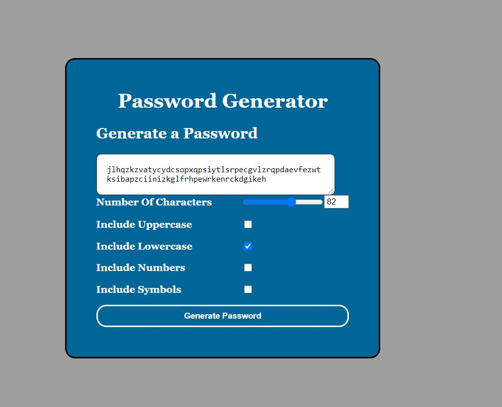

# TITLE
<h1>Password Generator</h1>

This is a web-page made using HTML, CSS and javascript.
​
## Contents

The web-site is composed of 3 pages, index.html ,script.js and styles.css. It also has images in the img folder

​
## User Story

AS AN employee with access to sensitive data
I WANT to randomly generate a password that meets certain criteria
SO THAT I can create a strong password that provides greater security

​
## Built With
​
* [VScode](https://code.visualstudio.com/) - The editor of choice
* [Terminal](https://gitforwindows.org/) - Git Bash
​
#### Initial interface and #### Final Interface

The following image demonstrates the application functionality:

​
​
### Licence
​
No Licences were used for this homeowrk 
​
### Link to the App
<a href="https://amankmr4.github.io/passwordgenerator/">Link to the Website</a>
https://amankmr4.github.io/passwordgenerator/

<a href="https://github.com/amankmr4/passwordgenerator.git">Link to the GitRepository</a>
https://github.com/amankmr4/passwordgenerator.git

​
## Authors
​
* **Aman Kumar** - 
aman.kmr4@yahoo.com

​
## Acknowledgments
​
* To 
- Klaus Paiva
- Sandes Pathak
- Mozamel Anwary
